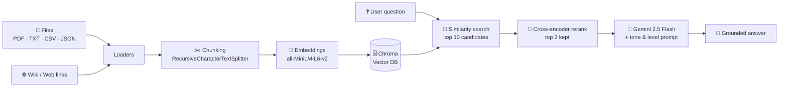

<div align="center">

# 🧠 Learn with AI

**Upload your own documents. Pick a tone. Pick a level. Ask anything.**
**Get answers grounded only in what you gave it — nothing made up.**

[](LICENSE)


[](https://github.com/raj-tembe/Learn-with-AI/commits/main)

</div>

---

**Learn with AI** is a self-hosted, NotebookLM-style study assistant. Feed it PDFs, text files, CSVs, JSON, or wiki links, and it builds a private retrieval-augmented-generation (RAG) pipeline over *just your material* — then answers your questions in the tone and depth you choose, with every response grounded in the source documents.

## 📖 Table of Contents

- [Features](#-features)
- [How It Works](#-how-it-works)
- [Tech Stack](#-tech-stack)
- [Quick Start](#-quick-start)
- [Using the App](#-using-the-app)
- [API Reference](#-api-reference)
- [Project Structure](#-project-structure)
- [Customization](#-customization)
- [Supported Document Types](#-supported-document-types)
- [Limitations](#-limitations)
- [Roadmap](#-roadmap)
- [Contributing](#-contributing)
- [License](#-license)

## ✨ Features

**Bring your own knowledge**
- 📄 Upload PDF, TXT, CSV, or JSON files — mix and match in a single session
- 🌐 Add web / Wikipedia links alongside your files
- 🔒 Every session gets its own isolated vector database — nothing leaks between users

**Answers tuned to how you learn**
- 🎭 **4 AI tones** — Default, Professional, Informal, Encouraging
- 🌱 **3 learning levels** — Beginner, Intermediate, Advanced
- 💬 Persistent chat with replayable history, per session

**A real retrieval pipeline, not a keyword search**
- 🔎 Semantic search over your documents via Chroma + sentence-transformer embeddings
- 🎯 Cross-encoder re-ranking (`ms-marco-MiniLM-L-6-v2`) narrows broad candidates down to the most relevant chunks before they ever reach the LLM
- 🤖 Answers generated by Google Gemini, constrained to only what was retrieved

## 🧭 How It Works



Every answer is generated strictly from the top re-ranked chunks — if your documents don't contain the answer, the assistant says so instead of guessing.

## 🛠️ Tech Stack

| Layer | Technology |
|---|---|
| Web framework | Flask |
| LLM orchestration | LangChain (`langchain-core`, `langchain-community`) |
| LLM | Google Gemini (`gemini-2.5-flash` via `langchain-google-genai`) |
| Vector store | ChromaDB |
| Embeddings | HuggingFace `sentence-transformers/all-MiniLM-L6-v2` |
| Re-ranking | `sentence-transformers` `CrossEncoder` (`ms-marco-MiniLM-L-6-v2`) |
| Document loaders | `pypdf`, `beautifulsoup4`, LangChain community loaders |
| Frontend | HTML5, CSS3 (custom, no framework), vanilla JavaScript, Font Awesome |

## 🚀 Quick Start

### Prerequisites
- Python 3.10+
- A [Google Gemini API key](https://makersuite.google.com/app/apikey)

### Installation

```bash
# 1. Clone the repository
git clone https://github.com/raj-tembe/Learn-with-AI.git
cd Learn-with-AI

# 2. Create and activate a virtual environment
python -m venv venv
source venv/bin/activate      # Windows: venv\Scripts\activate

# 3. Install dependencies
pip install -r requirements.txt
```

### Configure

Create a `.env` file in the project root (see `.env.example`):

```env
GEMINI_API_KEY=your_api_key_here
SECRET_KEY=your_secret_key_here
```

### Run

```bash
python app.py
```

Then open **http://localhost:5000** in your browser.

## 📚 Using the App

The UI is split into four tabs:

| # | Tab | What you do there |
|---|---|---|
| 1 | **Setup** | Pick your AI tone and learning level |
| 2 | **Documents** | Upload files and/or paste wiki links, then click **Ingest & Process Documents** |
| 3 | **Chat** | Ask questions about what you uploaded and get grounded, tone-matched answers |
| 4 | **History** | Revisit and replay earlier questions in the session |

## 🔌 API Reference

| Endpoint | Method | Description |
|---|---|---|
| `/` | GET | Main application page |
| `/api/session/create` | POST | Create a new session |
| `/api/settings/update` | POST | Update tone & level |
| `/api/documents/upload` | POST | Upload files / wiki links |
| `/api/documents/list` | GET | List documents in the current session |
| `/api/documents/ingest` | POST | Build the vector DB from uploaded documents |
| `/api/chat/ask` | POST | Ask a question, get a grounded answer |
| `/api/session/info` | GET | Get current session state |
| `/api/session/reset` | POST | Clear the session and start fresh |

## 🏗️ Project Structure

```
Learn-with-AI/
├── app.py                # Flask app: sessions, routes, RAG orchestration
├── vectordatabase.py      # Document loaders, chunking, Chroma ingestion
├── tones.py                # The 4 tone prompt templates + learning levels
├── config.py               # Reserved config constants (not yet wired into app.py)
├── requirements.txt         # Python dependencies
├── .env.example              # Sample environment file
├── templates/
│   └── index.html              # Single-page 4-tab UI
├── static/
│   ├── css/style.css             # Styling (CSS variables, responsive layout)
│   └── js/script.js               # API calls, session + chat handling
└── uploads/                        # Per-session files & vector DBs (auto-created)
```

## 🎨 Customization

**Add a new tone** — edit `tones.py`:
```python
custom_tone = """Your custom prompt template here..."""

PROMPT_MAP = {
    "default": default_tone,
    "professional": prof_tone,
    "informal": informal_tone,
    "encouraging": encouraging_tone,
    "custom": custom_tone,   # register it here
}
```

**Change the color scheme** — edit the CSS variables in `static/css/style.css`:
```css
:root {
    --primary-color: #6366f1;
    --primary-dark: #4f46e5;
    --success-color: #10b981;
    /* ... */
}
```

**Swap or tune the LLM** — in `app.py`:
```python
llm = ChatGoogleGenerativeAI(
    model="gemini-2.5-flash",  # swap in another Gemini model
    temperature=0.4,             # 0 = deterministic, 1 = more creative
)
```

## 📁 Supported Document Types

| Format | Extension | How it's loaded |
|---|---|---|
| PDF | `.pdf` | `PyPDFLoader` |
| Text | `.txt` | `TextLoader` |
| CSV | `.csv` | `CSVLoader` |
| JSON | `.json` | Custom loader — handles a single object, a flat list of strings, or a list of records |
| Web / Wiki | URL | `WebBaseLoader` |

## ⚠️ Limitations

- Max file size: 50MB per file
- Sessions expire after 1 hour of inactivity
- Requires a valid Gemini API key and an internet connection
- Documents and embeddings are processed and stored server-side, per session

## 🗺️ Roadmap

- [ ] Export chat history to PDF
- [ ] Multi-language support
- [ ] Advanced search filters
- [ ] Document annotation tools
- [ ] Real-time collaboration
- [ ] Custom LLM model selection

## 🤝 Contributing

1. Fork the repository
2. Create a feature branch
3. Commit your changes
4. Push to the branch
5. Open a Pull Request

## 📄 License

Released under the [AGPL-3.0 License](LICENSE).

---

<div align="center">

**Made with ❤️ by [Raj Tembe](https://github.com/raj-tembe)**

*Learn better, learn smarter, learn with AI.* 🚀

</div>
